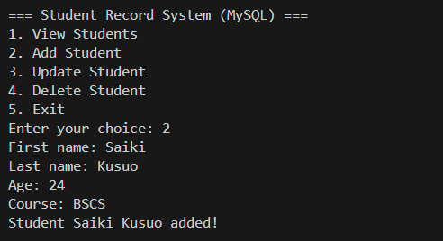
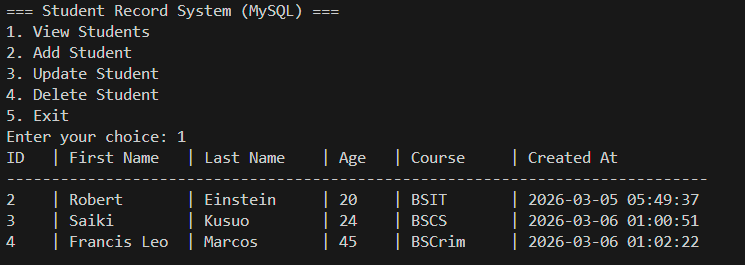
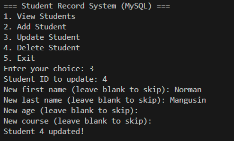

# Student Record System with MySQL

This Student Record System is a simple application that allows users to store, manage, and retrieve student information using a MySQL database. This project demonstrates basic database operations such as creating tables, inserting data, updating records, and retrieving information.

## Features

- Add new student records
- View student records
- Update student information
- Delete student records
- Store data using a MySQL database

## Technologies Used

- Python
- MySQL
- MySQL Connector for Python

## Installation

1. Install Python
2. Install MySQL Server
3. Install MySQL Connector for Python

Run this command in the terminal:  
  pip install mysql-connector-python  

## Database Setup

Open MySQL and run the following commands:  
  
CREATE DATABASE student_db;
  
USE student_db;  
  
CREATE TABLE students (  
id INT AUTO_INCREMENT PRIMARY KEY,  
first_name VARCHAR(50),  
last_name VARCHAR(50),  
age INT,  
course VARCHAR(100)  
);  

## Example Operations

1. Insert a student record

2. Display all student records

3. Update student information

## Author

- John Melo Gonato  
- https://github.com/Melo-dev24